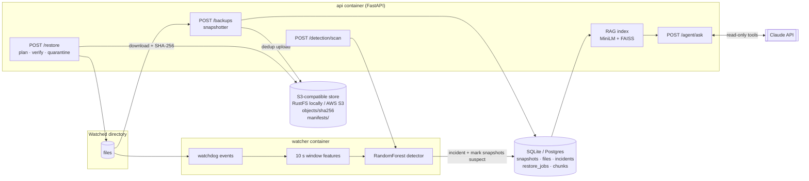

# AI Ransomware Recovery Agent

A backup and recovery service. It:

- snapshots a directory to S3-compatible storage
- **detects ransomware-like activity** with a scikit-learn model
- **restores the last clean snapshot** and verifies every file by SHA-256
- answers questions like *"What changed on Tuesday, and is it safe to restore?"* through a **Claude-powered RAG agent** over the backup metadata

FastAPI · boto3 (any S3: RustFS/MinIO locally, AWS S3 in cloud) · watchdog · scikit-learn · SQLAlchemy · Anthropic SDK · sentence-transformers + FAISS · Docker Compose

## Dashboard

Open **http://localhost:8000** after `make up` (it redirects to `/ui/`). It is a single page served by the API itself: plain HTML/CSS/JS with no build step and no CDN, so it works offline. It has six tabs:

| Tab | What you can do |
|---|---|
| **Overview** | Recovery-flow stepper (protected → attack detected → restore point → restored & verified → all clear), stats, activity timeline |
| **Snapshots** | Snapshot now, browse files sorted by entropy, **compare any two snapshots** (extension changes with entropy before → after) |
| **Detection** | Watcher heartbeat and live score vs threshold, model metrics, **scan now**, incidents with *why it fired* (feature z-scores), resolve |
| **Restore** | Recommended last clean snapshot, dry run, then a confirmed restore (in place + quarantine) showing SHA-256 verification; restore history |
| **Ask the agent** | Questions in plain English; the answer comes with server-validated citations and recommendation. Without an API key it shows the retrieval step on its own |
| **Lab** | Step-by-step safe simulation: seed → baseline → normal activity → attack → restore → clean, with a live watcher-score chart |

The Lab tab is off by default. Set `ENABLE_LAB=true` in `.env` to use it for the local demo.

## Architecture



**Recovery flow:** clean snapshot → attack → watcher alerts (incident; later snapshots become `suspect`) → agent explains and *recommends* a snapshot → a human calls `POST /restore` (dry run first) → SHA-256 verified → incident resolved.

## Requirements

- **Docker** with Docker Compose v2 (Docker Desktop on Windows/macOS). This is enough for the full stack.
- For local development or running tests: **Python 3.11+** (3.12 recommended).
- Optional: an **Anthropic API key** for the agent. Everything else works without one.
- Optional: `make`. Every target is a plain command, and the README shows each one.

## Setup: the `.env` file

All configuration comes from environment variables, loaded from `.env`. `.env.example` lists every variable with a comment. Create your `.env` with:

```bash
python scripts/init_env.py   # = make env; copies .env.example and fills a random object-store secret
```

| Variable | Required? | What it is |
|---|---|---|
| `AWS_ACCESS_KEY_ID` / `AWS_SECRET_ACCESS_KEY` | **yes** (local) | Credentials of the local object store. `init_env.py` generates them. In cloud mode, leave them empty and use an IAM role. |
| `ANTHROPIC_API_KEY` | optional | Turns on `/agent/ask`. Without it the agent returns 503 and the dashboard shows search results only. |
| `ENABLE_LAB` | optional | `true` turns on the dashboard Lab tab (safe simulator). Default `false`. |
| `ANTHROPIC_MODEL`, `AGENT_TIMEZONE`, `API_PORT`, ... | optional | See the comments in `.env.example`. |

`.env` is gitignored. Never commit it.

## Quick start (Docker)

```bash
python scripts/init_env.py   # once
docker compose up -d --build # = make up; builds the image (trains the model inside), starts s3 + api + watcher
docker compose exec api python scripts/demo.py   # = make demo
```

> **Local only by design:** the API and dashboard have no login, so every port is published on `127.0.0.1` and can't be reached from your network. See [SECURITY.md](SECURITY.md).

- Dashboard: http://localhost:8000
- API docs: http://localhost:8000/docs
- Object store console: http://localhost:9001

Port 8000 already taken? Set `API_PORT=8080` in `.env` (or the environment) before starting. `S3_PORT` and `S3_CONSOLE_PORT` work the same way.

> **Why RustFS and not MinIO:** MinIO stopped publishing community Docker images, so `minio/minio` no longer pulls. Compose runs [RustFS](https://github.com/rustfs/rustfs), an S3/MinIO-compatible server, instead. The app only knows `S3_ENDPOINT_URL`, so MinIO, SeaweedFS or real AWS S3 (`STORAGE_MODE=cloud`) work without code changes.

`make simulate` runs only the safe attack simulator, and `make logs` follows the JSON logs.

### Without make / without Docker (local dev)

```bash
python -m venv .venv && .venv/Scripts/activate        # source .venv/bin/activate on Linux/macOS
pip install -e ".[dev]"                               # exact Docker/CI versions: add -c requirements.lock
python scripts/init_env.py
python -m ml.generate_dataset && python -m ml.train   # = make train
docker compose up -d s3                               # or any S3 endpoint (see .env.example)
uvicorn app.main:app                                  # terminal 1
python -m app.detection.monitor                       # terminal 2
python scripts/demo.py --watch-dir sandbox/watched    # terminal 3 (= make demo)
pytest && ruff check .                                # = make test / make lint
```

## Demo output (real run, no API key set)

```text
=== 1. Seed sample files ...         seeded 120 files; false positives from seeding: 0
=== 2. Clean baseline snapshot       snap-20261006T052956Z-f0fc76  state=clean  files=121
=== 3. Simulated ransomware attack   simulated attack (fast) on 120 files
=== 4. Detection                     live monitor: ALERT
  incident #1 score=0.9873 files=241
  top features: mean_entropy_delta=2.94, frac_high_entropy_unexpected=0.99, unknown_ext_count=120
  post-attack snapshot snap-20261006T053013Z-c79858 state=suspect
=== 5. Ask the recovery agent        503 (no key) -> retrieval-only view; top hit: [incident] Incident 1 ...
=== 6. Restore last clean snapshot   dry run: create=120 unchanged=1 extra=121
  job #2 succeeded: restored=120 verified=121/121 failed=0 quarantined=121
=== 7. Verify                        diff clean -> post-restore: all 0, unchanged=121
VERIFIED: tree matches the clean snapshot byte-for-byte
```

With `ANTHROPIC_API_KEY` set, step 5 returns a Markdown answer with four sections: what changed, evidence, risk, recommendation. It also returns the cited snapshot and incident ids, checked against the DB, the validated recommended snapshot, and the list of tool calls the agent made.

## API

| Method | Path | Description |
|---|---|---|
| GET  | `/health` | DB + object store (503 if degraded); model loaded flag |
| POST | `/backups` | Snapshot `WATCH_DIR` (SHA-256 dedup); `suspect` while an incident is open |
| GET  | `/backups`, `/backups/{id}` | List / detail with per-file sha256, entropy, size, mtime |
| GET  | `/backups/{id}/diff/{other}` | added / removed / modified / renamed / **extension_changed** |
| POST | `/detection/scan` | Score last snapshot vs live dir (or two snapshots) |
| GET  | `/detection/incidents` | Incidents: score, top features, affected files |
| POST | `/detection/incidents/{id}/resolve` | Close incident → new snapshots trusted again |
| GET  | `/detection/status` | Model info, watcher heartbeat, open incidents |
| GET  | `/restore/candidates` | Snapshots vs incident + computed **last clean snapshot** |
| POST | `/restore` | `{snapshot_id, target_path?, dry_run=true, force, quarantine_extras}` |
| GET  | `/restore/jobs` | Restore audit log |
| POST | `/agent/ask` | `{question}` → answer + validated citations + recommendation |
| GET  | `/agent/search` | Retrieval only (date parsing + vector search), no LLM call |
| POST | `/agent/reindex` | Force RAG index sync |
| GET  | `/info` | Non-secret runtime config (paths, flags) for the dashboard |
| POST | `/lab/seed`, `/lab/benign`, `/lab/attack`, `/lab/clean` | Drive the sandbox-only simulator (`ENABLE_LAB=true` only; 404 otherwise) |
| GET  | `/ui/` | Dashboard (strict CSP, no inline script) |

Every response carries `X-Request-ID`, and the same id appears on every JSON log line for that request.

## Model metrics

From `ml/artifacts/metrics.json` (`python -m ml.train`, seed 42, reproducible run to run):
- 10,400 synthetic 10-second windows, 23% of them attacks
- 25% held out as the test set
- threshold picked from out-of-fold training predictions, capped at 1% false-positive rate

| Model | Precision | Recall | F1 | ROC-AUC | FPR |
|---|---|---|---|---|---|
| IsolationForest (unsupervised baseline) | 0.967 | 0.635 | 0.767 | 0.965 | 0.65% |
| **RandomForest (selected)** | **0.995** | **0.985** | **0.990** | **0.998** | **0.15%** |
| GradientBoosting | 0.980 | 0.983 | 0.982 | 0.998 | 0.60% |

**Recall on attack families left out of training:**
- partial encryption: 0.988
- in-place stealth: 0.988
- random extension: 1.000

**Weakest cases:**
- most false positives come from ML-checkpoint writes (3.7% of those windows)
- encrypt-copy-then-delete attacks have the lowest recall (95%)

## Safety

- **Simulator** (`simulator/fake_ransomware.py`):
  - runs only inside `./sandbox`; root and home directories are refused, with symlinks resolved first
  - touches only files it seeded itself, and only while their hash is unchanged
  - writes random bytes, never real encryption
  - has no network, process or crypto imports, which a test checks
- **Agent:** has read-only tools only and can never restore. Its recommendation is checked server-side, and a non-clean snapshot is rejected.
- **Restore:**
  - dry run by default; restores to a separate directory unless told otherwise
  - path-traversal guard on every file path
  - atomic file placement with SHA-256 checks
  - extra files are quarantined, never deleted
  - every restore is recorded in an audit log

## Limitations

- **The detector is trained on synthetic data.** It includes hard cases on purpose, but real-world precision will be lower. Encrypting a file that is already compressed (`.docx`, `.jpg`) *in place* barely changes its entropy, and only rate and spread features cover it.
- **Real deployment base rates:** a 0.15% false-positive rate per 10-second window still means roughly 13 false windows per day. Alerts are merged into incidents and restores are human-gated, but a real deployment needs tuning on real telemetry.
- **Snapshots run inside the request.** There is no job queue and no retention or GC policy for blobs.
- **SQLite is shared by two containers.** Fine on one host; use `DATABASE_URL=postgresql://…` beyond that.
- **The agent is only as good as the indexed metadata.** It does not read file contents (by design: privacy and prompt injection).
- **The image is large (2.5 GB),** mostly torch (CPU) and sentence-transformers. A smaller option is an ONNX MiniLM runtime instead of torch.

## Future work

- S3 Object Lock / versioning so blobs survive stolen credentials
- Real telemetry (Sysmon / eBPF / ETW) and per-host baselines; SHAP explanations
- Background job queue for snapshots and restores; blob GC with retention policies
- Postgres + pgvector instead of SQLite + FAISS; multi-tenant auth
- Agent evals: a graded question set built from recorded incidents

See [DESIGN.md](DESIGN.md) for the reasoning behind each design choice.
